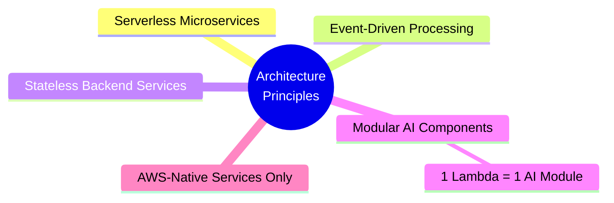
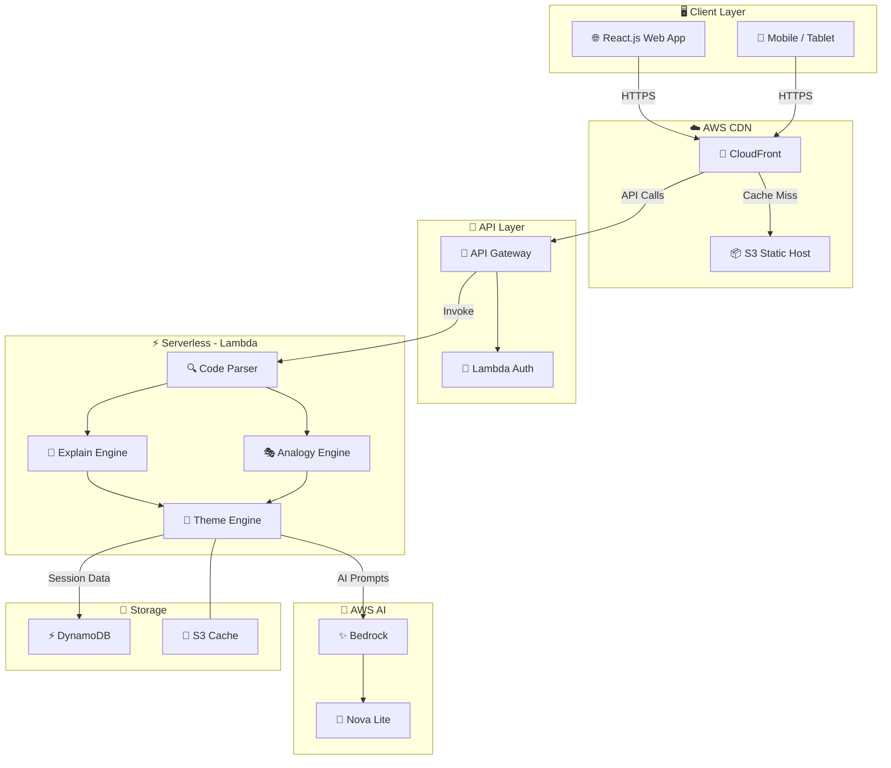
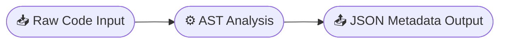
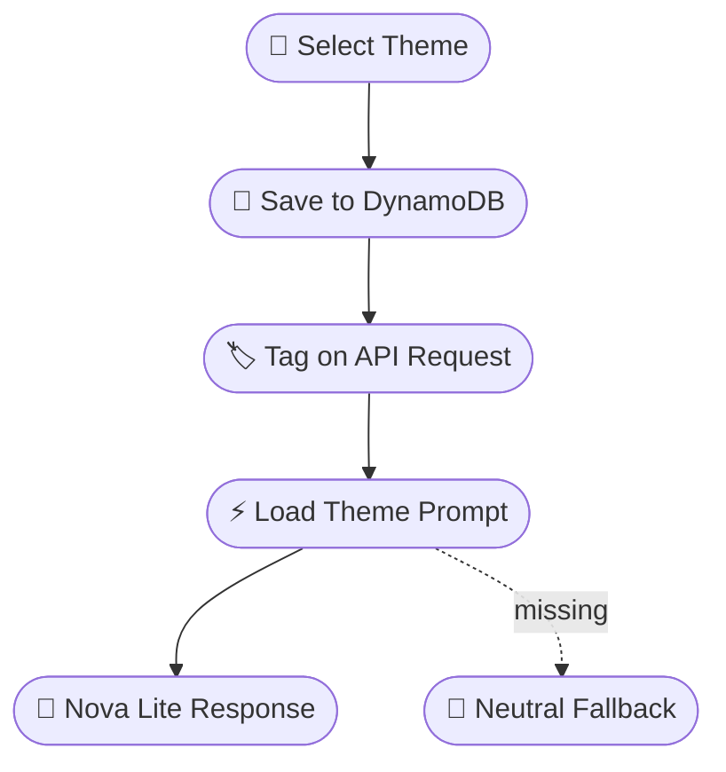
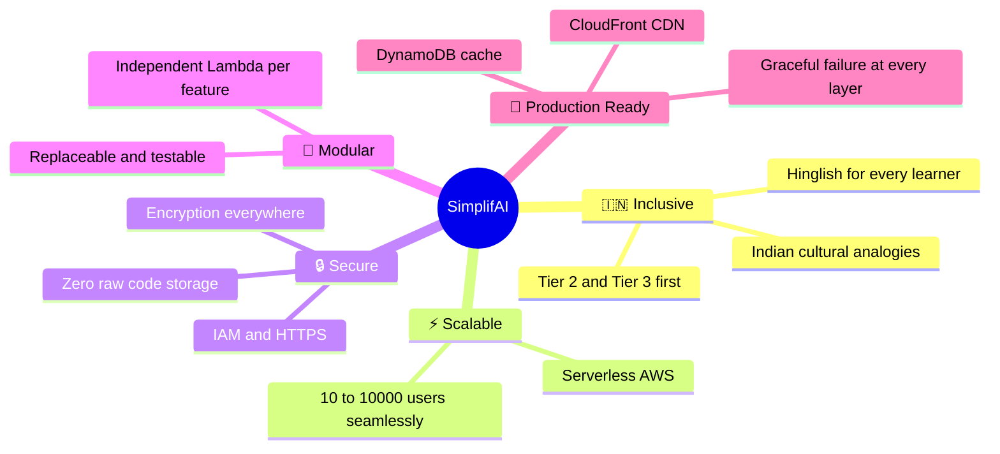

<div align="center">

# 🏗️ Design Document


<br/>

> **"Logic wahi, samjhane ka andaaz apna."**
>
> *India's first serverless, Hinglish-first AI code explainer — built for Bharat's Tier 2/3 learners.*

</div>

---

## 📋 Table of Contents

| # | Section |
|---|---|
| 1 | [Overview](#1-overview) |
| 2 | [Architecture Style](#2-architecture-style) |
| 3 | [High-Level System Architecture](#3-high-level-system-architecture) |
| 4 | [Component Design](#4-component-design) |
| 5 | [AI Intelligence Layer](#5-ai-intelligence-layer) |
| 6 | [Theme Engine Design](#6-theme-engine-design) |
| 7 | [Session Management & Data Design](#7-session-management--data-design) |
| 8 | [Non-Functional Design](#8-non-functional-design) |
| 9 | [Security Design](#9-security-design) |
| 10 | [Failure Handling Strategy](#10-failure-handling-strategy) |
| 11 | [Future Design Extensions](#11-future-design-extensions) |
| 12 | [Design–Requirement Alignment](#12-designrequirement-alignment) |
| 13 | [Conclusion](#13-conclusion) |

---

## 1. Overview

The **AI Code Explainer** is designed as a **serverless, scalable, and modular system** that converts user-written code into **Hinglish explanations with Indian cultural analogies**.

Built for India's Tier 2/3 students — where English documentation is the #1 barrier to learning, not lack of intelligence or drive.

### Design Priorities

| Priority | Goal | How |
|---|---|---|
| 🎯 **Beginner-Friendly** | No jargon, no intimidation | Hinglish prompts, friendly tone by design |
| ⚡ **Low Latency** | Response under 2 seconds | CloudFront + DynamoDB cache + parallel Lambda |
| 🧩 **Modular AI** | Each feature is independent | Separate Lambda per AI module |
| ☁️ **AWS-Native** | No servers to manage | Fully serverless — Lambda, Bedrock, DynamoDB |
| 🇮🇳 **Cultural Context** | Relatable analogies | Cricket, Bollywood, Recipe theme engine |

---

## 2. Architecture Style



### Why Serverless?

| Traditional Server Approach | Our Serverless Design |
|---|---|
| Always running = always costing | Pay only per request |
| Manual scaling required | Auto-scales to 10,000 users instantly |
| Infrastructure management overhead | Zero ops — AWS manages everything |
| Single point of failure | Distributed, fault-isolated Lambda modules |

---

## 3. High-Level System Architecture



### 📋 System Flow

| Step | Actor | Action |
|---|---|---|
| **1** | User | Submits code through React.js frontend |
| **2** | CloudFront | Serves static assets from S3 with edge caching |
| **3** | API Gateway | Routes request → Lambda Authorizer validates session |
| **4** | Code Parser Lambda | Detects language via AST analysis |
| **5** | Explanation Engine | Crafts Hinglish prompt → sends to Amazon Bedrock |
| **6** | Claude 3.5 Sonnet | Generates Hinglish explanation with cultural context |
| **7** | Cultural Analogy Engine | Enhances response with selected theme analogies |
| **8** | API Gateway | Returns enriched JSON to browser |
| **9** | DynamoDB + S3 | Caches results for repeat queries |

---

## 4. Component Design

### 4.1 Frontend Layer

| Responsibility | Technology |
|---|---|
| Code input with syntax highlighting | **Monaco Editor** (VS Code engine) |
| Theme selection — Cricket / Bollywood / Recipe | **React.js** + **Tailwind CSS** |
| Line-by-line explanation display | **React.js** components |
| Expandable explanation sections | State-managed accordion UI |
| Complexity visualization | Animated Big-O Chart component |
| Quiz generation | MCQ Panel component |
| PDF report download | Client-side PDF generator |

**Tech Stack:** React.js / Next.js · Tailwind CSS · Monaco Editor

---

### 4.2 API Gateway Layer

| Responsibility | Design Choice |
|---|---|
| Secure request handling | HTTPS enforced — no HTTP allowed |
| Request routing to Lambdas | REST-based endpoints, JSON payloads |
| Rate limiting | 100 requests/min per IP — abuse prevention |
| Input validation | Schema validation at gateway level |

**Endpoints:**

```
POST  /explain     →  Hinglish code explanation
POST  /debug       →  Friendly error analysis
POST  /quiz        →  5 MCQ generation from code
POST  /complexity  →  Big-O time & space analysis
```

---

### 4.3 Lambda Orchestrator

| Responsibility | Benefit |
|---|---|
| Input validation | Bad code rejected before hitting AI |
| Language detection | Correct prompt template selected |
| AI module coordination | Parallel execution where possible |
| Response aggregation | Single clean JSON returned to frontend |
| Fault isolation | One Lambda failure does not affect others |

**Module Benefits:**
- ✅ Loose coupling — each AI module is independently deployable
- ✅ Easy scalability — scale only the modules under load
- ✅ Fault isolation — partial failure handled gracefully

---

## 5. AI Intelligence Layer

### 5.1 Code Parser Module

**Purpose:** Parse code line-by-line and extract structured metadata for AI prompts.



| Feature | Detail |
|---|---|
| **Parsing Method** | AST-based (Abstract Syntax Tree) |
| **Languages Supported** | Python, JavaScript, Java + Auto Detect |
| **Detects** | Variables, loops, functions, conditions, classes |
| **Output** | Structured metadata JSON for downstream Lambdas |

---

### 5.2 Hinglish Translator Engine

**Purpose:** Convert technical AI output into natural, beginner-friendly Hinglish.

```
❌  Technical:  "This for loop iterates over integers 0 through 9."

✅  Hinglish:   "Yeh for loop ek cricket match ki tarah hai —
                10 overs hain, har over mein ek ball print hoti hai!"
```

| Design Principle | Implementation |
|---|---|
| **Controlled Prompts** | Theme-specific templates per language |
| **Beginner Vocabulary** | Simple Hindi + English mix, no jargon |
| **Consistent Tone** | Like a dost explaining, not a textbook |
| **Example Output** | *"Variable matlab ek dabba hota hai jisme value store hoti hai."* |

---

### 5.3 Cultural Analogy Engine

**Purpose:** Map programming concepts to familiar Indian cultural contexts so students can connect, not just memorize.

#### Concept Mapping Table

| Programming Concept | 🏏 Cricket Mode | 🎬 Bollywood Mode | 🍛 Recipe Mode |
|---|---|---|---|
| **Loop** | Cricket overs | Dance rehearsal rounds | Boiling / stirring steps |
| **Function** | Bowling action — reuse karo! | Film script scene | Cooking recipe |
| **Array** | Team batting lineup | Film cast list | Ingredient list |
| **Condition** | DRS review decision | Movie plot twist | Taste check — *namak theek hai?* |
| **Class** | Team franchise | Film production house | Thali category |
| **Variable** | Scoreboard value | Dialogue placeholder | Bowl mein rakhi cheez |
| **Recursion** | Replay highlight reel | Flashback scene | Recipe inside a recipe |

---

### 5.4 Galti Se Mistake Debugger

**Purpose:** Detect syntax and logical errors — explain them with encouragement, not frustration.

```
❌  Standard:  "SyntaxError: invalid syntax at line 3"

✅  Ours:      "Koi baat nahi! Ek chhoti si galti hai — line 3 mein
               colon (:) bhool gaye. Aisa fix karo:  for i in range(10):"
```

**Design Rules:**

| Rule | Implementation |
|---|---|
| No scary messages | All errors rewritten in friendly Hinglish |
| Encouraging phrases | *"Koi baat nahi"*, *"Galti se mistake ho gaya"*, *"Try karo yeh:"* |
| Fix with analogy | Every error fix includes a cultural analogy example |
| Pattern tracking | Common mistakes stored in DynamoDB for proactive tips |

---

## 6. Theme Engine Design



| Responsibility | Implementation |
|---|---|
| **Store selected theme** | Persisted in DynamoDB per session |
| **Apply theme consistently** | Theme context in every Lambda request |
| **Theme-specific prompts** | Separate prompt template per theme per module |
| **Runtime switching** | No page reload required — state update only |
| **Graceful fallback** | Falls back to neutral Hinglish if theme fails |

---

## 7. Session Management & Data Design

### 7.1 DynamoDB Data Model

| Table | Partition Key | Key Fields | TTL |
|---|---|---|---|
| `ai-explainer-sessions` | `sessionId (S)` | theme, lastVisit, explainCount | 7 days |
| `ai-explainer-cache` | `codeHash (S)` | explanation, complexity, language | 30 days |
| `ai-explainer-analytics` | `sessionId (S)` | quizScores, mistakePatterns, engagement | 90 days |

### 7.2 What Is Stored

- ✅ User theme preference (Cricket / Bollywood / Recipe)
- ✅ Explanation history (hashed — code is never stored raw)
- ✅ Common mistake patterns for proactive tips
- ✅ Quiz scores and comprehension metrics

### 7.3 Privacy & Data Safety

| Principle | Implementation |
|---|---|
| **No raw code storage** | Code is hashed before caching — never stored as-is |
| **No PII collected** | Anonymous session IDs only |
| **Encryption at rest** | DynamoDB SSE + S3 server-side encryption |
| **Encryption in transit** | HTTPS-only — no HTTP endpoints |
| **Automatic cleanup** | TTL-based deletion — data doesn't linger |
| **Consent required** | Permanent storage only with explicit user consent |

---

## 8. Non-Functional Design

### 8.1 Performance

| Target | Strategy |
|---|---|
| **< 2s response time** | CloudFront edge cache + DynamoDB explain cache |
| **Fast cold starts** | Lambda provisioned concurrency for core functions |
| **Parallel AI execution** | Multiple Lambda modules invoked in parallel |
| **Cache-first** | S3 analogy library checked before any AI call |

### 8.2 Scalability

| Challenge | Solution |
|---|---|
| **10,000 concurrent users** | Lambda auto-scales with zero configuration |
| **Traffic spikes** | API Gateway throttling + SQS overflow queue |
| **Database load** | DynamoDB on-demand mode — no capacity planning |
| **Static asset load** | CloudFront absorbs all static traffic before backend |

### 8.3 Availability

| Target | Architecture |
|---|---|
| **99.9% uptime** | Multi-AZ Lambda + DynamoDB replication |
| **AI failure** | Graceful degradation — serve cached response |
| **Module failure** | Isolation — one Lambda down, others keep running |
| **Region failure** | CloudFront multi-region edge network |

---

## 9. Security Design

| Layer | Mechanism | Detail |
|---|---|---|
| **Transport** | HTTPS + TLS 1.2+ | Enforced via CloudFront + API Gateway |
| **Authentication** | Lambda Authorizer | Session token validation on every request |
| **Authorization** | IAM Roles | Least-privilege per Lambda function |
| **Input Sanitization** | API Gateway + Lambda | Code sanitized before reaching AI prompt |
| **Prompt Injection** | 500 line limit + sanitization | Prevents prompt injection attacks |
| **Data at Rest** | DynamoDB SSE + S3 SSE | All stored data encrypted |
| **Rate Limiting** | API Gateway throttle | 100 req/min per IP — abuse prevention |
| **Monitoring** | CloudWatch Alarms | Auto-alert on anomalous request patterns |

---

## 10. Failure Handling Strategy

| Failure Scenario | Detection | Handling Strategy |
|---|---|---|
| **AI Timeout** | CloudWatch > 2s alarm | Serve cached explanation from S3 |
| **Invalid Code Input** | Lambda validation | Friendly Hinglish: *"Yeh code samajh nahi aaya, ek baar check karo"* |
| **High Traffic Spike** | API Gateway 429 | Throttling + SQS queue for overflow |
| **Partial Lambda Failure** | CloudWatch error rate | Module isolation — all other features stay live |
| **Bedrock Unavailable** | HTTP 503 response | Graceful degradation with pre-cached responses |
| **DynamoDB Timeout** | Connection timeout | Stateless fallback — skip cache, continue silently |
| **Cold Start Delay** | First invoke > 1s | Provisioned concurrency on Explanation Engine Lambda |

---

## 11. Future Design Extensions

| Phase | Feature | Description |
|---|---|---|
| **Phase 2** | 🌏 Regional Language Support | Tamil, Marathi, Bengali, Gujarati — locale-based detection |
| **Phase 3** | 💻 VS Code Extension | Right-click → *"Explain in Hinglish"* inside the editor |
| **Phase 4** | 📴 Offline Mode | Service Worker caches last 10 explanations for zero-connectivity use |
| **Phase 5** | 📊 Analytics Dashboard | Student progress tracking, weak area identification, teacher view |
| **Phase 6** | 🔊 Voice Output | Text-to-speech Hinglish explanations for accessibility |

---

## 12. Design–Requirement Alignment

| Requirement | Designed Component | Status |
|---|---|---|
| Hinglish-first explanations | Hinglish Translator Engine + Claude 3.5 prompt templates | ✅ Fully Covered |
| Cultural relatability | Cultural Analogy Engine — Cricket / Bollywood / Recipe | ✅ Fully Covered |
| Beginner-friendly debugging | Galti Se Mistake Debugger with friendly tone | ✅ Fully Covered |
| Theme-based learning | Theme Engine Lambda + DynamoDB persistence | ✅ Fully Covered |
| Session management | DynamoDB sessions table + TTL cleanup | ✅ Fully Covered |
| AWS-native scalability | Lambda + API Gateway + DynamoDB on-demand | ✅ Fully Covered |
| Response time < 2s | CloudFront + cache + parallel Lambda execution | ✅ Fully Covered |
| 10,000 concurrent users | Lambda auto-scale + API throttling | ✅ Fully Covered |
| 99.9% availability | Multi-AZ + graceful degradation pattern | ✅ Fully Covered |
| Data privacy | No raw code storage + TTL + encryption at rest | ✅ Fully Covered |
| AI for Bharat vision | Hinglish + Indian analogies + Tier 2/3 first design | ✅ Fully Covered |

---

## 13. Conclusion

This design ensures the **AI Code Explainer** delivers on every promise:



> *"Logic wahi, samjhane ka andaaz apna."*

---

<div align="center">

**Team AI²** &nbsp;·&nbsp; Vivek Maurya & Saurav Kumar &nbsp;·&nbsp; Made with ❤️ in India 🇮🇳

*AWS AI for Bharat Hackathon 2026 &nbsp;·&nbsp; Theme: AI for Learning & Developer Productivity*

</div>
